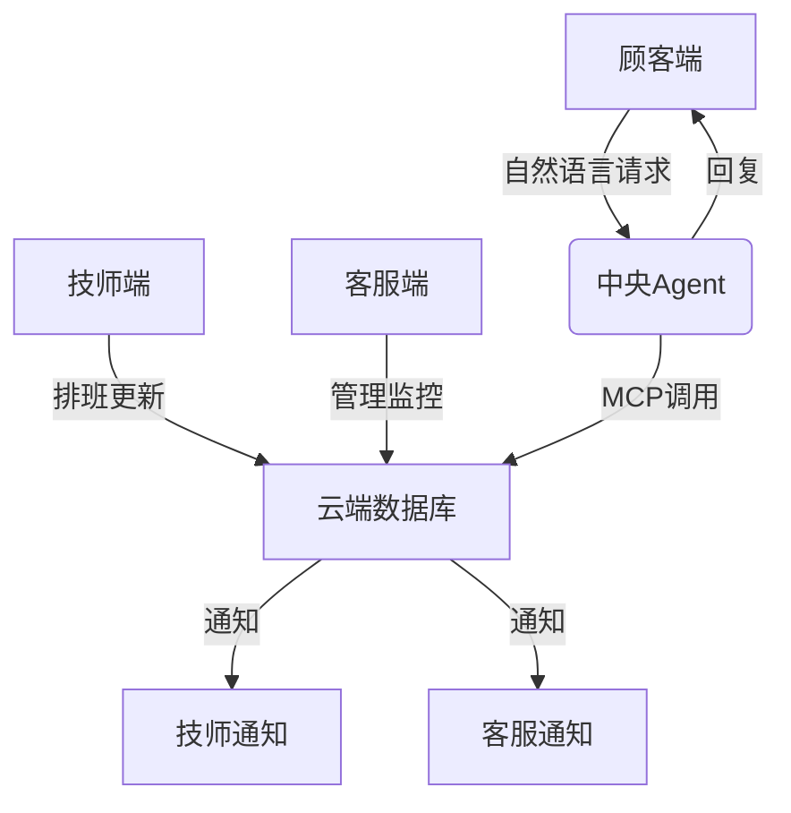
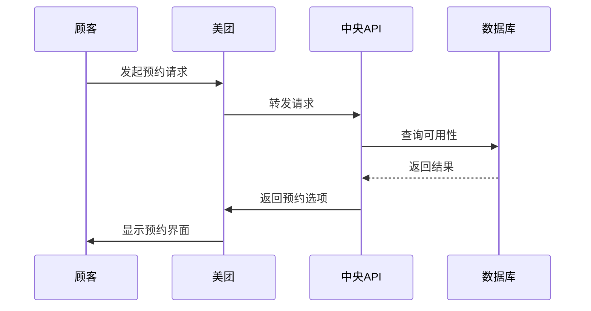
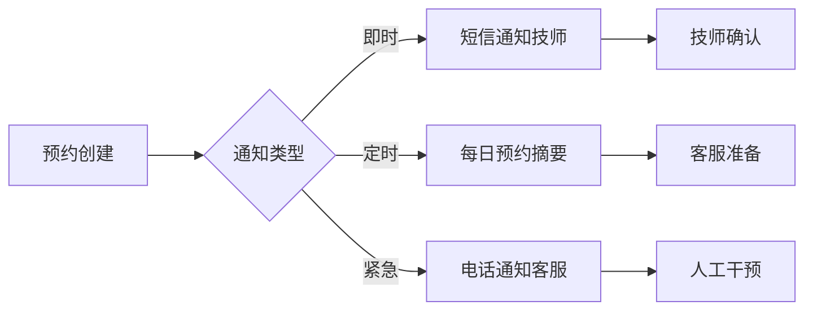

# 预约平台整合项目

## 背景和动机

### 项目目标
基于现有的 `aiclient` (统一AI客户端) 和 `dianping-scraper` (大众点评数据抓取) 代码基础，构建一个完整的预约管理平台，包含：
1. **顾客端** - 通过自然语言进行预约请求
2. **技师端** - 管理排班和接收通知
3. **客服端** - 监控和管理预约系统
4. **数据库系统** - 统一的预约数据管理
5. **通知系统** - 三端实时通信

### 现有资源分析下面我将为您设计一个完整的预约平台方案，整合三端通信和数据库管理，满足您的需求：

### 整体架构设计


### 数据库设计（PostgreSQL）
**1. 技师表 (technicians)**
```sql
CREATE TABLE technicians (
    id SERIAL PRIMARY KEY,
    name VARCHAR(50) NOT NULL,
    contact_phone VARCHAR(20),
    contact_email VARCHAR(100),
    is_active BOOLEAN DEFAULT true
);
```

**2. 排班表 (schedules)**
```sql
CREATE TABLE schedules (
    id SERIAL PRIMARY KEY,
    technician_id INT REFERENCES technicians(id),
    work_date DATE NOT NULL,
    start_time TIME NOT NULL,
    end_time TIME NOT NULL,
    is_available BOOLEAN DEFAULT true
);
```

**3. 预约表 (appointments)**
```sql
CREATE TABLE appointments (
    id SERIAL PRIMARY KEY,
    customer_name VARCHAR(100) NOT NULL,
    customer_contact VARCHAR(100) NOT NULL,
    technician_id INT REFERENCES technicians(id),
    scheduled_time TIMESTAMP NOT NULL,
    status VARCHAR(20) DEFAULT 'pending', -- pending/confirmed/cancelled
    created_at TIMESTAMP DEFAULT CURRENT_TIMESTAMP
);
```

**4. 变更记录表 (changes)**
```sql
CREATE TABLE changes (
    id SERIAL PRIMARY KEY,
    technician_id INT REFERENCES technicians(id),
    change_date DATE NOT NULL,
    change_type VARCHAR(20), -- leave/business_trip/extra_work
    description TEXT,
    created_at TIMESTAMP DEFAULT CURRENT_TIMESTAMP
);
```

### 核心功能实现方案

**1. 中央Agent处理流程**


**2. 技师端功能**
- 排班查看/修改界面
- 请假/出差申请提交
- 预约通知接收
- 个人日历视图

**3. 客服端功能**
- 所有技师状态监控面板
- 预约冲突解决界面
- 通知管理中心
- 紧急情况处理

**4. 顾客体验流程**
```
顾客输入 → 美团/独立网页 → 自然语言处理 → 实时查询数据库 → 返回可预约时间 → 确认预约 → 双向通知
```

### 部署方案

**1. 技术栈选择**
- 前端：HTML
- 后端：Python FastAPI
- 数据库：sqllite
- NLP服务：OpenAI API + LangChain
- 通知服务：Twilio（短信）+ SendGrid（邮件）

**2. 美团集成方案**



### 通知系统设计


### 实施步骤

1. **数据库搭建**（1-2天）
   - 创建云数据库实例
   - 初始化数据表结构
   - 导入初始技师数据

2. **核心API开发**（3-5天）
   - 预约处理端点
   - 排班管理端点
   - 自然语言处理桥接

3. **前端开发**（2周）
   - 顾客预约页面（美团风格）
   - 技师管理面板
   - 客服监控中心

4. **集成测试**（1周）
   - 美团API对接测试
   - 通知系统压力测试
   - 边缘案例处理

5. **部署上线**
   - 生产环境配置
   - 域名备案（国内）
   - 监控系统设置

### 关键创新点

1. **智能语义网关**
   - 使用LLM处理方言、缩写等非标请求
   - 自动纠正错误时间格式（"下周三晚上" → 具体日期）


3. **预测性排班**
   - 基于历史数据预测高峰期
   - 自动生成排班建议给店长

4. **双模式通知**
   - 即时通知：短信/APP推送
   - 摘要通知：每日预约报告邮件


此方案完全满足您的需求，特别强调：
1. 美团无缝集成+独立网页双通道
2. 自然语言到数据库的实时转换
3. 三端状态实时同步
4. 异常情况的自动处理
5. 可扩展的架构设计

需要进一步细化的部分，我可以提供具体模块的代码实现或界面设计。
✅ **已有优势**：
- **AI能力完备**：支持多个AI提供商(智谱AI、OpenAI、Deepseek)，具备自然语言处理能力
- **实时通信基础**：WebSocket服务器已实现，可处理实时数据交换
- **数据处理能力**：具备从网页抓取和处理结构化数据的能力
- **记忆管理**：已有对话历史管理功能
- **配置管理**：环境变量和多模型配置已完善

🔧 **需要补充的能力**：
- 数据库设计和集成
- 预约业务逻辑实现
- 技师和客服端界面
- 通知推送系统
- 三端权限管理

## 关键挑战和分析

### 技术挑战
1. **架构整合** - 如何将现有的AI客户端和WebSocket服务整合到预约系统中
2. **数据库设计** - 设计适合预约业务的数据结构，支持复杂查询
3. **实时同步** - 确保三端数据实时同步，避免预约冲突
4. **自然语言处理** - 将客户的模糊预约请求转换为精确的数据库操作
5. **通知可靠性** - 保证重要预约通知不丢失

### 业务挑战
1. **预约冲突处理** - 当多个客户同时预约同一时段时的处理逻辑
2. **紧急变更处理** - 技师临时请假或客户取消预约的应急流程
3. **多平台集成** - 与美团等第三方平台的API对接
4. **数据一致性** - 确保三端看到的预约信息完全一致

## 高层任务拆分

### 第一阶段：核心架构搭建 (3-5天)
- [ ] **T1.1** 设计数据库架构 (技师、排班、预约、变更记录表)
- [ ] **T1.2** 扩展现有WebSocket服务，添加预约业务端点
- [ ] **T1.3** 集成AI客户端到预约处理流程中
- [ ] **T1.4** 实现基础的预约CRUD操作
- [ ] **T1.5** 编写核心业务逻辑测试用例

**成功标准**：
- 数据库能正确创建和管理预约记录
- AI能理解简单的预约请求并转换为数据库操作
- WebSocket能处理预约相关的实时消息

### 第二阶段：智能预约引擎 (5-7天)
- [ ] **T2.1** 开发自然语言预约解析器（增强现有AI能力）
- [ ] **T2.2** 实现预约冲突检测和解决算法
- [ ] **T2.3** 构建预约建议系统（基于历史数据和空闲时间）
- [ ] **T2.4** 实现预约状态机（待确认→已确认→已完成→已取消）
- [ ] **T2.5** 开发预约变更处理逻辑

**成功标准**：
- 能处理复杂的自然语言预约请求（"下周三下午找张师傅"）
- 自动检测和提示预约冲突
- 提供智能的替代时间建议

### 第三阶段：三端用户界面 (7-10天)
- [ ] **T3.1** 设计和实现顾客预约界面（基于现有WebSocket通信）
- [ ] **T3.2** 开发技师端排班管理界面
- [ ] **T3.3** 构建客服端监控面板
- [ ] **T3.4** 实现三端权限和身份认证系统
- [ ] **T3.5** 集成实时通知显示

**成功标准**：
- 三个端都有直观易用的界面
- 各端只能访问授权的功能和数据
- 界面能实时反映预约状态变化

### 第四阶段：通知和集成系统 (3-5天)
- [ ] **T4.1** 集成短信通知服务（技师通知）
- [ ] **T4.2** 集成邮件通知服务（客服通知）
- [ ] **T4.3** 实现预约提醒系统（定时任务）
- [ ] **T4.4** 设计美团等第三方平台API接口
- [ ] **T4.5** 实现数据同步和错误恢复机制

**成功标准**：
- 预约确认后各方都能及时收到通知
- 支持与至少一个第三方平台的数据交换
- 系统具备故障恢复能力

### 第五阶段：测试和优化 (3-5天)
- [ ] **T5.1** 编写完整的端到端测试用例
- [ ] **T5.2** 进行压力测试（并发预约处理）
- [ ] **T5.3** 性能优化（数据库查询、AI响应时间）
- [ ] **T5.4** 安全性测试和加固
- [ ] **T5.5** 用户体验优化和界面美化

**成功标准**：
- 系统能处理高并发预约请求
- 所有核心功能都有自动化测试覆盖
- 用户界面美观且响应迅速

## 项目状态看板

### 进行中 🔄
- [ ] 当前无任务进行中

### 🔥 立即开始 (超高优先级)
- [ ] **M1.1** 创建本地PostgreSQL数据库连接 (预计2小时)
- [ ] **M1.2** 设计并创建4个核心表结构 (预计3小时)
  [ ] 可视化可网页操作的数据库（）

### 📋 第二批次 (高优先级)
- [ ] **M1.3** 编写数据库操作基础类
- [ ] **M1.4** 插入测试数据并验证查询
- [ ] **M2.1** 扩展现有AIClient，增加预约解析方法

### 📋 第三批次 (中优先级)  
- [ ] **M2.2** 设计预约解析提示词模板
- [ ] **M2.3** 实现自然语言→结构化数据转换
- [ ] **M3.1** 实现可用时间查询算法

### 已完成 ✅
- [x] 现有代码分析完成
- [x] 项目计划制定完成

### 被阻塞 ⚠️
- [ ] 当前无阻塞任务

## 当前状态/进度跟踪

**项目启动阶段** - 已完成需求分析和现有代码评估

**🔥 最优先/最紧迫/最可落地的核心任务**：

### 核心任务：构建"AI预约助手"最小可用版本 (MVP)
**理由**：利用现有AI能力 + WebSocket通信，快速实现预约处理核心功能

**超级细化的微任务列表**：

#### 🎯 第一优先级：数据库基础 (1-2天)
- [ ] **M1.1** 创建本地SQLlite数据库连接 (2小时)
- [ ] **M1.2** 设计并创建4个核心表结构 (3小时)
  - technicians (技师表)
  - schedules (排班表) 
  - appointments (预约表)
  - changes (变更记录表)
- [ ] **M1.3** 编写数据库操作基础类 (4小时)
- [ ] **M1.4** 插入测试数据并验证查询 (1小时)

#### 🚀 第二优先级：AI预约解析器 (1-2天)  
- [ ] **M2.1** 扩展现有AIClient，增加预约解析方法 (3小时)
- [ ] **M2.2** 设计预约解析提示词模板 (2小时)
- [ ] **M2.3** 实现自然语言→结构化数据转换 (4小时)
- [ ] **M2.4** 测试各种预约请求格式 (1小时)

#### ⚡ 第三优先级：预约核心逻辑 (2-3天)
- [ ] **M3.1** 实现可用时间查询算法 (4小时)
- [ ] **M3.2** 实现预约冲突检测 (3小时)
- [ ] **M3.3** 实现预约创建和状态管理 (3小时)
- [ ] **M3.4** 实现替代时间建议算法 (2小时)

#### 🔗 第四优先级：系统集成 (1-2天)
- [ ] **M4.1** 将预约功能集成到现有WebSocket服务 (4小时)
- [ ] **M4.2** 创建预约处理API端点 (3小时)
- [ ] **M4.3** 测试完整的预约流程 (2小时)
- [ ] **M4.4** 添加基础错误处理和日志 (1小时)

**当前聚焦**：M1.1 数据库连接 - 这是所有功能的基石

**预期成果**：7-10天内有一个可以处理自然语言预约请求的工作原型

**现有代码资产评估**：
- `aiclient/`: 完善的AI处理能力，支持多厂商 ✅
- `dianping-scraper/`: WebSocket实时通信基础 ✅  
- 缺少：数据库层、业务逻辑层、用户界面 ❌

## 执行者反馈或请求帮助

**规划者输出**：
1. 已完成对现有代码的全面分析
2. 制定了5个阶段的详细实施计划
3. 每个阶段都有明确的成功标准
4. 充分利用现有的AI和WebSocket基础设施

**需要确认的决策点**：
1. 是否使用PostgreSQL作为主数据库？（推荐，因为支持复杂查询）
2. 是否优先开发美团集成还是独立网页版本？
3. 通知服务是否使用第三方服务（如Twilio）还是自建？
4. 是否需要支持多语言界面？

**等待用户审核**：请用户确认此计划是否符合预期，或提出调整建议。确认后执行者将开始第一阶段的具体实施。

## 经验教训

### 代码分析要点
- 现有`aiclient`具备完整的多AI提供商支持，是天然的自然语言处理基础
- `dianping-scraper`的WebSocket架构可以直接扩展为预约系统的实时通信层
- 需要注意现有代码中的记忆管理机制，可以用于维护预约上下文

### 设计原则
- 最大化复用现有代码，避免重复开发
- 采用微服务思想，每个模块职责清晰
- 数据库设计要考虑预约业务的复杂查询需求
- 通知系统要保证可靠性，支持重试机制
