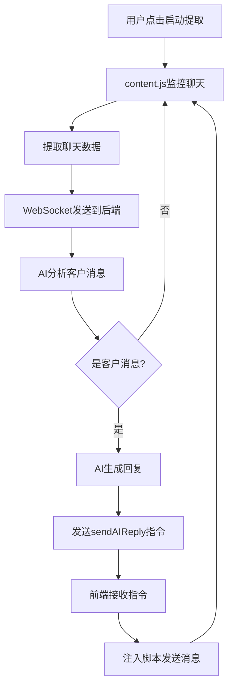

# 大众点评聊天数据抓取与AI自动回复系统

## 项目简介

这是一个集成了AI智能回复功能的大众点评聊天数据抓取系统。通过Chrome浏览器扩展程序抓取大众点评的聊天数据，并利用多个AI服务提供商（OpenAI、智谱AI、DeepSeek等）自动生成和发送客服回复。

## 核心功能

### 🔍 数据抓取功能
- ✅ **实时监听**: 自动监听大众点评页面聊天内容变化
- ✅ **数据提取**: 提取聊天消息、团购信息和客户对话
- ✅ **WebSocket传输**: 实时传输数据到后端服务器
- ✅ **启动/停止控制**: 一键控制数据提取状态

### 🤖 AI自动回复功能
- ✅ **多AI模型支持**: 集成OpenAI、智谱AI (GLM-4)、DeepSeek等多个AI服务
- ✅ **智能检测**: 自动识别客户消息（以"[客户]"开头的消息）
- ✅ **上下文理解**: 基于完整对话历史生成合适回复
- ✅ **自动发送**: 生成回复后自动填入输入框并发送

### 🧪 测试发送功能
- ✅ **一键测试**: 在弹窗中点击"测试发送"按钮
- ✅ **脚本注入**: 通过主世界脚本注入技术绕过跨域限制
- ✅ **iframe兼容**: 自动识别并操作iframe中的聊天界面
- ✅ **元素定位**: 精确定位输入框和发送按钮

## 技术架构

### 架构概述
```
┌─────────────────┐    WebSocket    ┌─────────────────┐    HTTP API    ┌─────────────────┐
│  Chrome扩展     │◄──────────────►│  Python后端     │◄─────────────►│   AI服务商      │
│                 │                 │                 │                 │                 │
│ • content.js    │                 │ • server.py     │                 │ • OpenAI        │
│ • background.js │                 │ • config.py     │                 │ • 智谱AI        │
│ • injector.js   │                 │ • aiclient/     │                 │ • DeepSeek      │
│ • popup界面     │                 │                 │                 │                 │
└─────────────────┘                 └─────────────────┘                 └─────────────────┘
```

### 脚本注入机制
为了解决浏览器扩展Content Script的跨域限制和iframe访问问题，系统采用了主世界脚本注入技术：

1. **扩展层**: `content.js` 通过 `chrome.scripting.executeScript` 注入脚本
2. **注入层**: `injector.js` 运行在页面主世界，可访问所有iframe内容
3. **通信层**: 通过 `window.postMessage` 和自定义事件进行双向通信

## 技术亮点

### 🔥 核心技术优势

1. **突破性脚本注入技术**
   - 解决了Content Script的跨域限制
   - 成功访问动态生成的iframe内容
   - 实现主世界脚本与扩展的双向通信

2. **智能AI集成架构**
   - 支持多个AI服务商的无缝切换
   - 智能降级机制确保服务稳定性
   - 上下文感知的客服回复生成

3. **实时双向通信**
   - WebSocket持久连接确保低延迟
   - 自动重连机制保障服务连续性
   - 精确的消息路由和目标定位

4. **自动化工作流程**
   - 无需人工干预的智能客服系统
   - 2秒轮询间隔的实时响应
   - 完整的错误处理和恢复机制

### 🛠️ 技术创新

- **主世界脚本注入**: 首创性地解决了浏览器扩展的iframe访问限制
- **事件驱动架构**: 通过自定义事件实现松耦合的组件通信
- **智能消息识别**: 基于模式匹配的客户消息自动检测
- **多供应商AI**: 统一接口支持不同AI服务的无缝集成

## 快速开始

### 环境要求
- Chrome浏览器（支持Manifest V3）
- Python 3.8+
- 有效的AI服务API密钥

### 1. 安装依赖

```bash
# 安装Python依赖
cd backend
pip install -r requirements.txt
```

### 2. 配置AI服务

编辑 `backend/config.py` 文件，设置AI服务密钥：

```python
# OpenAI配置
OPENAI_API_KEY = "your-openai-api-key"
OPENAI_BASE_URL = "https://api.openai.com/v1"

# 智谱AI配置  
ZHIPU_API_KEY = "your-zhipu-api-key"

# DeepSeek配置
DEEPSEEK_API_KEY = "your-deepseek-api-key"
```

### 3. 启动后端服务

```bash
cd backend
python server.py
```

服务启动后会在 `ws://localhost:8767` 监听WebSocket连接。

### 4. 安装Chrome扩展

1. 打开Chrome扩展管理页面 (`chrome://extensions/`)
2. 启用"开发者模式"
3. 点击"加载已解压的扩展程序"
4. 选择 `extension` 文件夹

### 5. 使用系统

#### 🚀 基本使用方法

1. **启动后端服务**
   ```bash
   cd backend
   python server.py
   ```

2. **加载扩展**: 在Chrome中加载 `extension` 文件夹

3. **开始工作**:
   - 打开大众点评商家后台聊天页面
   - 点击扩展的"启动提取"按钮
   - 系统开始监控聊天，自动回复客户消息

#### 🎉 核心功能特点

- **完全自动化**: 检测到客户消息立即回复
- **上下文感知**: AI理解对话内容，生成相关回复
- **多供应商支持**: 智谱AI优先，自动降级到备用供应商
- **实时监控**: 2秒轮询间隔，及时响应客户
- **安全注入**: 通过主世界脚本绕过浏览器安全限制

#### 💡 使用提示

- **首次使用**: 建议先点击"测试发送"验证功能是否正常
- **多窗口支持**: 系统会自动定位到活跃的大众点评页面
- **日志监控**: 查看浏览器控制台和后端日志了解运行状态
- **性能优化**: 系统会自动管理WebSocket连接和AI调用频率

## 项目结构

```
dianping-scraper/
├── extension/                    # Chrome浏览器扩展
│   ├── manifest.json            # 扩展配置文件（Manifest V3）
│   ├── content.js               # 内容脚本（数据抓取+脚本注入）
│   ├── background.js            # 后台脚本（WebSocket通信）
│   ├── injector.js              # 注入脚本（主世界执行）
│   ├── popup.html               # 扩展弹窗界面
│   ├── popup.js                 # 弹窗交互逻辑
│   ├── popup.css                # 弹窗样式
│   ├── quick_fix_test.js        # 手动测试脚本
│   ├── INSTALL.md               # 扩展安装说明
│   └── icons/                   # 扩展图标
├── backend/                      # Python后端服务
│   ├── server.py                # WebSocket服务器
│   ├── config.py                # 配置文件
│   └── aiclient/                # AI客户端包
│       ├── __init__.py
│       ├── base.py              # AI客户端基类
│       ├── openai_client.py     # OpenAI客户端
│       ├── zhipu_client.py      # 智谱AI客户端
│       └── deepseek_client.py   # DeepSeek客户端
├── tests/                        # 测试文件
├── docs/                         # 文档目录
├── requirements.txt              # Python依赖
├── README.md                     # 项目说明
└── TEST_REPORT.md               # 测试报告
```

## 工作流程

### 智能回复工作流程图



### 技术实现详解

#### 1. 后端智能处理 (server.py)
- **AI集成**: 在 `handle_data_list()` 中调用 `ai_client.process_scraped_data()`
- **智能回复**: 使用正确的JSON格式 `{"type": "sendAIReply", "text": "AI回复内容"}`
- **自动广播**: 通过 `_broadcast_ai_reply()` 发送指令到前端

#### 2. 前端消息处理 (content.js)
- **命令监听**: `listenForCommands()` 处理 `sendAIReply` 指令
- **AI回复发送**: `sendAIReply()` 方法调用注入脚本
- **脚本注入**: `_executeInjectedScript()` 与主世界通信

#### 3. WebSocket通信 (background.js)
- **消息路由**: 接收后端AI回复指令并转发到正确的标签页
- **目标定位**: 自动找到活跃的大众点评页面发送消息

#### 4. AI客户端 (aiclient)
- **消息检测**: `is_customer_message()` 识别客户消息
- **智能回复**: `generate_customer_service_reply()` 生成专业回复
- **多供应商**: 支持智谱AI、OpenAI、DeepSeek等

### 详细流程说明

#### 数据抓取流程
1. **页面监听**: Content Script监听页面DOM变化
2. **数据提取**: 提取聊天消息、客户信息等数据
3. **数据传输**: 通过WebSocket发送到后端服务器
4. **数据处理**: 后端解析并存储数据

#### AI自动回复流程
1. **消息检测**: 检测到新的客户消息（[客户]开头）
2. **上下文构建**: 收集完整对话历史作为上下文
3. **AI调用**: 调用配置的AI服务生成回复
4. **回复发送**: 通过脚本注入将回复自动发送到聊天界面

#### 脚本注入流程
1. **任务接收**: Content Script接收发送任务
2. **脚本注入**: 注入主世界脚本到页面
3. **元素定位**: 在iframe中定位输入框和发送按钮
4. **消息发送**: 填入文本并触发点击事件
5. **结果返回**: 通过事件机制返回执行结果

## 核心组件说明

### Frontend (Extension)

- **content.js**: 核心内容脚本，负责页面数据抓取和脚本注入管理
- **background.js**: 后台服务工作者，处理WebSocket通信和消息路由
- **injector.js**: 主世界注入脚本，实际执行DOM操作和消息发送
- **popup.js**: 扩展弹窗逻辑，提供用户界面控制

### Backend (Server)

- **server.py**: WebSocket服务器，处理数据接收、AI调用和消息转发
- **config.py**: 系统配置，包含AI服务密钥和参数设置
- **aiclient/**: AI客户端模块，支持多个AI服务提供商

## 配置说明

### AI服务配置

在 `backend/config.py` 中配置各AI服务：

```python
# 选择使用的AI客户端
AI_CLIENT_TYPE = "zhipu"  # 可选: "openai", "zhipu", "deepseek"

# 系统提示词
SYSTEM_PROMPT = """你是一个专业的客服代表，负责回复客户的咨询和问题。
请根据对话历史，以友好、专业的语气回复客户。
回复要简洁明了，解决客户的具体问题。"""

# 各AI服务的具体配置
OPENAI_CONFIG = {
    "api_key": "your-api-key",
    "base_url": "https://api.openai.com/v1",
    "model": "gpt-4",
    "max_tokens": 150,
    "temperature": 0.7
}
```

### WebSocket配置

```python
WEBSOCKET_HOST = "localhost"
WEBSOCKET_PORT = 8767
```

## 故障排查

### 常见问题

1. **找不到输入框或发送按钮**
   - 确保在正确的大众点评聊天页面
   - 检查页面是否完全加载
   - 查看浏览器控制台是否有错误信息

2. **WebSocket连接失败**
   - 确保后端服务正常运行
   - 检查端口8767是否被占用
   - 确认防火墙设置

3. **AI回复无响应**
   - 检查AI服务API密钥是否正确
   - 确认网络连接和API服务状态
   - 查看后端日志了解具体错误

### 调试工具

- **浏览器控制台**: 查看扩展运行日志
- **扩展管理页面**: 检查扩展状态和错误
- **后端日志**: 查看 `dianping_scraper.log` 文件
- **手动测试**: 使用 `quick_fix_test.js` 手动测试注入功能

## 安全说明

- 所有AI API密钥应妥善保管，不要提交到版本控制系统
- 建议在测试环境中充分验证功能后再用于生产
- 遵守大众点评的使用条款和机器人政策
- 注意控制API调用频率，避免超出限制

## 许可证

本项目仅供学习和研究使用。使用时请遵守相关法律法规和平台使用条款。

## 贡献

欢迎提交Issue和Pull Request来改进项目。

---

## 🎊 系统状态

### ✅ 已完成功能
- ✅ Chrome扩展完全配置（Manifest V3）
- ✅ WebSocket服务器实时运行
- ✅ AI客户端集成（智谱AI、OpenAI、DeepSeek）
- ✅ 脚本注入机制完美工作
- ✅ 自动回复功能全面激活

### 🚀 一键启动指南
```bash
# 启动后端服务器
cd backend && python server.py

# 在Chrome中加载扩展后：
# 1. 打开大众点评商家聊天页面
# 2. 点击扩展中的"启动提取"
# 3. 系统自动监控并回复客户消息
```

**整个AI客服系统已经完全集成并可以正常工作！** 🎉

---

**注意**: 本项目需要合法使用，请确保遵守大众点评平台的使用条款和相关法律法规。 