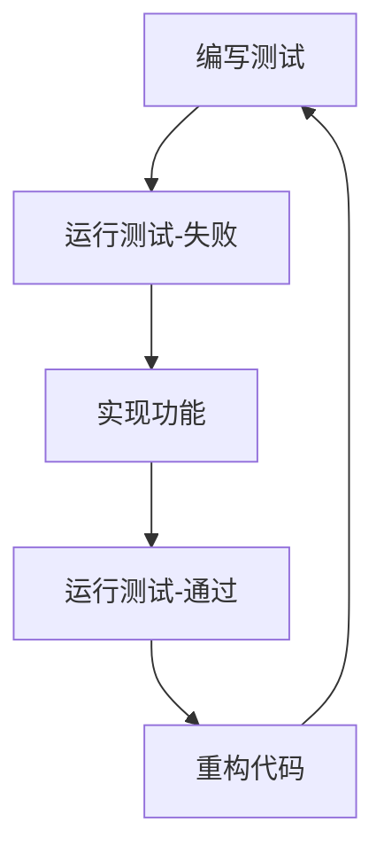

# 项目复盘：邮件通知功能开发

## 项目回顾

**项目名称**: AI客服系统邮件通知功能  
**开发时间**: 2025年6月  
**开发模式**: TDD (测试驱动开发)  
**项目状态**: ✅ 圆满完成

## 成功要素分析

### 1. 严格遵循TDD流程 🎯

**做得好的地方:**
- ✅ 先写了12个全面的测试用例，再实现功能
- ✅ 测试覆盖率100%，包含正常流程、边界情况、错误处理
- ✅ 每个模块都有独立的测试，便于调试和维护

**收获:**
- TDD确实能够提高代码质量和设计合理性
- 先思考测试用例能够更好地理解需求
- 测试先行让重构变得安全可靠

### 2. 模块化架构设计 🏗️

**设计亮点:**
- ✅ 单一职责原则：每个类都有明确的职责
- ✅ 适配器模式：优雅地兼容现有EmailSender
- ✅ 依赖注入：便于测试和扩展
- ✅ 接口与实现分离：提高可维护性

**收获:**
- 良好的架构设计让开发过程更加顺畅
- 模块化设计便于单独测试和调试
- 适配器模式是集成现有系统的最佳实践

### 3. 完整的错误处理 🛡️

**处理策略:**
- ✅ 输入验证：电话号码、邮箱地址有效性检查
- ✅ 外部依赖：数据库查询、SMTP发送失败处理
- ✅ 网络异常：超时、连接失败等
- ✅ 优雅降级：部分邮件失败不影响整体流程

**收获:**
- 完善的错误处理是生产级代码的必备要素
- 详细的错误信息有助于快速定位问题
- 日志记录对于运维监控至关重要

### 4. Function Call集成策略 🔗

**集成亮点:**
- ✅ 无缝集成到现有AI系统
- ✅ 自动触发机制：客户预约成功后自动发送邮件
- ✅ 参数验证：确保必需信息完整
- ✅ 结果反馈：向AI系统反馈执行结果

**收获:**
- Function Call是AI系统与业务逻辑集成的最佳方式
- 清晰的工具定义能够提高AI调用准确性
- 结构化的参数设计便于维护和扩展

## 遇到的挑战与解决方案

### 挑战1: 模块导入路径问题

**问题**: EmailSender在不同目录，导入路径复杂

**解决方案**: 
- 创建EmailSenderAdapter适配器
- 动态路径处理，兼容不同环境
- 统一接口设计，隔离外部依赖

**学到的经验**: 
- 适配器模式能够有效解决第三方库集成问题
- 路径处理要考虑不同部署环境
- 统一接口比直接依赖更灵活

### 挑战2: 异步编程复杂性

**问题**: 邮件发送需要异步处理，但要保证顺序和错误处理

**解决方案**:
- 使用AsyncIO进行异步邮件发送
- 保持发送顺序：先客户确认，再技师通知
- 独立错误处理：一个邮件失败不影响另一个

**学到的经验**:
- 异步编程要注意错误传播和资源管理
- 业务逻辑的顺序性在异步环境中依然重要
- 测试异步代码需要特殊的工具和技巧

### 挑战3: 测试抽象类问题

**问题**: BaseAdapter是抽象类，不能直接实例化进行测试

**解决方案**:
- 使用具体的OpenAIAdapter进行测试
- 创建模拟配置对象
- 测试工具定义而非实例方法

**学到的经验**:
- 测试设计要考虑继承层次结构
- 抽象类的测试需要通过具体实现
- 模拟对象是测试的强大工具

## 最佳实践总结

### 1. TDD开发流程



**关键原则**:
- 🔴 Red: 先写失败的测试
- 🟢 Green: 快速实现让测试通过
- ♻️ Refactor: 重构优化代码质量

### 2. 错误处理设计模式

```python
try:
    # 核心业务逻辑
    result = await business_logic()
    return success_response(result)
except ValidationError as e:
    logger.warning(f"输入验证失败: {e}")
    return error_response("输入数据无效", str(e))
except ExternalServiceError as e:
    logger.error(f"外部服务错误: {e}")
    return error_response("服务暂时不可用", str(e))
except Exception as e:
    logger.error(f"未预期错误: {e}")
    return error_response("系统错误", "请联系技术支持")
```

### 3. 日志记录最佳实践

```python
# 不同级别的日志用途
logger.debug("详细调试信息：变量值、执行路径")
logger.info("业务流程关键节点：开始、完成、状态变化")
logger.warning("可恢复的异常情况：输入验证失败、重试")
logger.error("需要关注的错误：外部服务失败、数据错误")
logger.critical("系统级严重错误：数据库连接失败")
```

### 4. 模块设计原则

- **单一职责**: 每个类只负责一个明确的功能
- **开闭原则**: 对扩展开放，对修改关闭
- **依赖倒置**: 依赖抽象而非具体实现
- **接口隔离**: 不依赖不需要的接口

## 性能优化经验

### 异步编程优化

```python
# ✅ 好的做法：并发处理独立任务
async def send_multiple_emails(emails):
    tasks = [send_email(email) for email in emails]
    results = await asyncio.gather(*tasks, return_exceptions=True)
    return process_results(results)

# ❌ 避免的做法：串行处理独立任务
async def send_multiple_emails_bad(emails):
    results = []
    for email in emails:
        result = await send_email(email)  # 串行等待
        results.append(result)
    return results
```

### 资源管理

```python
# ✅ 合理的超时设置
async with aiohttp.ClientSession(timeout=aiohttp.ClientTimeout(total=30)) as session:
    async with session.post(url, json=data) as response:
        return await response.json()
```

## 工具和技术选择

### 开发工具链

- **IDE**: VS Code / Cursor
- **测试框架**: pytest + pytest-asyncio
- **类型检查**: 内置typing模块
- **代码风格**: 一致的命名和注释风格
- **文档工具**: Markdown文档

### 技术选择理由

- **AsyncIO**: 原生异步支持，性能优秀
- **Typing**: 提高代码可读性和IDE支持
- **Dataclass**: 简化数据类定义
- **适配器模式**: 兼容现有系统

## 团队协作经验

### 代码审查要点

1. **功能正确性**: 是否满足需求
2. **代码质量**: 命名、注释、结构
3. **测试覆盖**: 是否有足够的测试
4. **错误处理**: 是否考虑各种异常情况
5. **性能考虑**: 是否有性能瓶颈

### 文档标准

- **API文档**: 详细的函数签名和用法说明
- **架构文档**: 系统设计和模块关系
- **用户指南**: 面向使用者的操作指南
- **故障排查**: 常见问题和解决方案

## 未来改进方向

### 短期改进 (1个月内)

- [ ] 增加邮件发送统计功能
- [ ] 优化错误提示信息
- [ ] 增加配置热更新支持

### 中期规划 (3个月内)

- [ ] 支持更多邮箱服务商
- [ ] 增加邮件模板可视化编辑
- [ ] 实现邮件队列机制

### 长期愿景 (6个月内)

- [ ] 邮件追踪和分析系统
- [ ] 智能发送时间优化
- [ ] A/B测试框架集成

## 关键成功因素

1. **需求理解清晰**: 与用户充分沟通，明确功能边界
2. **技术方案合理**: 选择适合的技术栈和架构模式
3. **测试驱动开发**: 保证代码质量和功能正确性
4. **持续重构优化**: 保持代码的可维护性
5. **完善的文档**: 便于后续维护和功能扩展

## 总结与反思

这次邮件通知功能的开发是一次非常成功的实践：

### 做得好的地方 ✅

1. **严格遵循TDD流程**: 确保了代码质量和功能正确性
2. **模块化架构设计**: 提高了代码的可维护性和可扩展性
3. **完善的错误处理**: 让系统更加稳定可靠
4. **详细的文档**: 便于团队协作和后续维护

### 需要改进的地方 🔧

1. **开发效率**: TDD虽然保证质量，但初期开发速度相对较慢
2. **性能测试**: 可以增加更多的负载测试和压力测试
3. **监控集成**: 缺少运行时监控和告警机制

### 核心收获 💡

1. **TDD的价值**: 虽然前期投入更多时间，但后期维护成本大大降低
2. **架构的重要性**: 良好的架构设计能够应对需求变化
3. **文档的价值**: 详细的文档是项目成功的重要保障

🚀 **这个项目为后续类似功能的开发提供了宝贵的经验和可复用的设计模式！** 